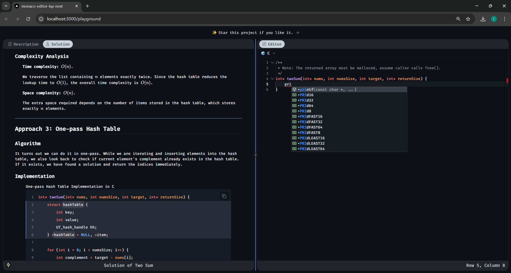

<div align="center">

# Judge4c

✨ A full-stack, open-source online judge platform designed to elevate college programming education.



</div>

## ⚠️ WSL Users: Critical Configuration

### 🐧 Network Mode Requirement

When using Windows Subsystem for Linux (WSL), you **must** configure your network mode as **Mirrored** to ensure proper LSP server connectivity. Standard WSL network configurations may create IPv6 conflicts that block Monaco-LSP communication.

#### 🔧 Mirror Mode Setup:

1. Open WSL settings ⚙️
2. Navigate to **Network** section 🌐
3. Select **Mirrored** mode 🔄
4. Restart WSL instance 💻

Complete these steps before launching the editor for seamless LSP integration! 🎉

## 🚀 Getting Started

### 🐳 Docker Deployment (Recommended)

Deploy the project quickly using Docker. Follow the steps below:

#### Step 1: Clone the Repository

```shell
git clone https://github.com/massbug/judge4c
cd judge4c
```

#### Step 2: Install Dependencies

This project uses `bun` as the default package manager, but you can also use other package managers like `npm`, `yarn`, or `pnpm` if you prefer.

If you choose to use a package manager other than `bun`, you should delete the `bun.lock` file from your project directory.

The `Dockerfile` is designed to dynamically detect and adapt to the package manager you are using, ensuring compatibility with your preferred tool.

```shell
bun install
```

#### Step 3: Configure Environment Variables

1. Copy the example environment file:

   ```sh
   cp .env.example .env
   ```

2. Open the `.env` file and set the following variables:

   - **PostgreSQL Credentials**:
     ```sh
     POSTGRES_USER="your_postgres_user"
     POSTGRES_PASSWORD="your_postgres_password"
     POSTGRES_DB="your_postgres_db"
     ```

   - **Authentication Secret**:
     Generate a secure secret key using:
     ```sh
     bunx auth secret
     ```
     Then, set the `AUTH_SECRET` variable:
     ```sh
     AUTH_SECRET="your_auth_secret"
     ```

   - **GitHub OAuth** (Optional):
     If you need GitHub OAuth, replace the following variables with your GitHub OAuth credentials:
     ```sh
     AUTH_GITHUB_ID="your_github_client_id"
     AUTH_GITHUB_SECRET="your_github_client_secret"
     ```

   - **Authentication Callback URL**:
     Set the base URL for authentication callbacks (typically your app's domain):
     ```sh
     AUTH_URL="http://localhost:3000"  # Replace with your production URL if deployed
     ```
   
   - **OpenAI API Configuration** (Optional):
     If you use OpenAI-based features, provide your API key and custom endpoint (if applicable):
     ```sh
     OPENAI_API_KEY="your_openai_api_key"              # Required for AI features
     OPENAI_BASE_URL="your_openai_base_url_if_custom"  # Optional, for self-hosted proxies
     ```

#### Step 4: Start the Application

Once the environment variables are configured, start the application using Docker Compose:

```sh
docker compose up -d --build
```

#### Step 5: Access the Application

The application should now be running. You can access it at:

- **Web Interface**: `http://localhost:3000`
- **LSP Service (C Language)**: `ws://localhost:4594/clangd`
- **LSP Service (C++ Language)**: `ws://localhost:4595/clangd`

#### 📁 `.env.example` File

For reference, you can see the content of the `.env.example` file.

## ⚙️ Technical Configuration

### LSP Server Mapping

| **Language** | **LSP Server** | **Port** |
|--------------|----------------|----------|
| `C`          | `clangd`       | `4594`   |
| `C++`        | `clangd`       | `4595`   |

## 📦 Dependency Management

### 🔒 Version Lock Requirements

**Critical Pairing**:  
| Package                 | Max Version | Reference |  
|-------------------------|-------------|-----------|  
| `monaco-editor`         | ≤0.36.1     | [Compatibility Matrix](https://github.com/TypeFox/monaco-languageclient/blob/main/docs/versions-and-history.md#monaco-editor--codingamemonaco-vscode-api-compatibility-table) |  
| `monaco-languageclient` | ≤5.0.1      |           |  

**Version Lock Rationale**:  
1. **API Stability**  
   - Newer `monaco-editor` (≥0.40.0) breaks `monaco-languageclient` integration  
   - v0.36.1 matches `@codingame/monaco-vscode-api@1.76.9` requirements  

2. **LSP Feature Breakdown**  
   - Version mismatches disable:  
     - Auto `textDocument/didOpen` events  
     - `textDocument/inlayHint` resolution  
     - `textDocument/documentLink` functionality  

3. **Version Conflict**  
   - `@codingame` package versioning (e.g., `11.1.2`) ≠ `monaco-editor` versions (e.g., `0.36.1`)  
   - `@monaco-editor/react` depends on `monaco-editor` versioning scheme  

**Failure Indicators**:  
- ✔️ WebSocket connection established  
- ❌ Missing syntax highlighting  
- ❌ No autocomplete suggestions  
- ❌ Silent LSP initialization failures  
